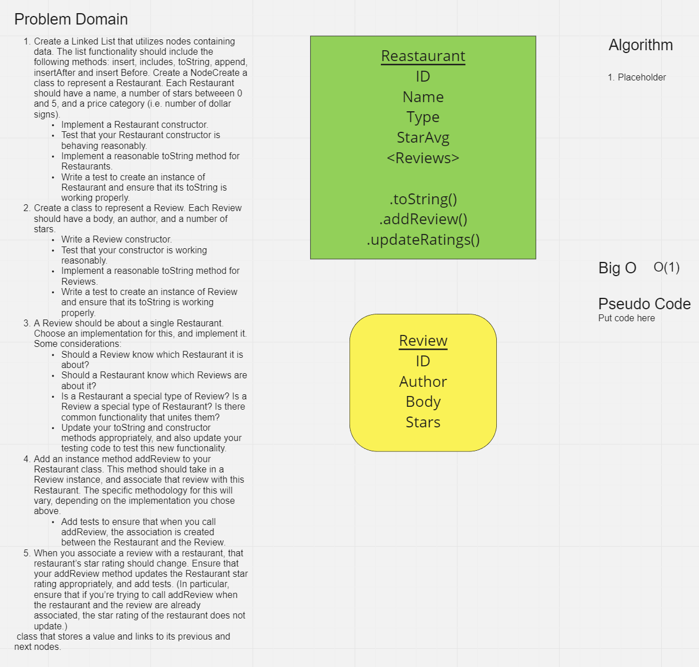

# Inheritance

A lesson in the fundamentals of inheritance in object-oriented programming.

## Index

[Home](../README.md)

## Whiteboard

## Testing

Open a terminal in the root directly of this project and enter `./gradlew test`.